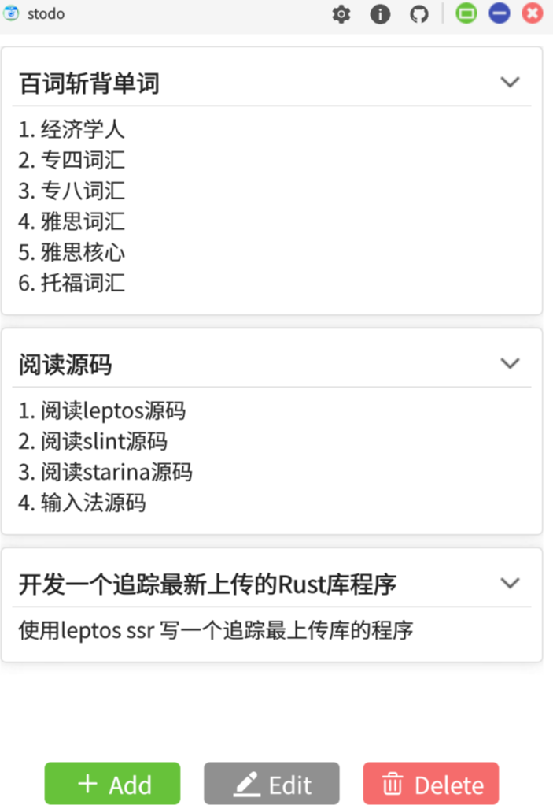
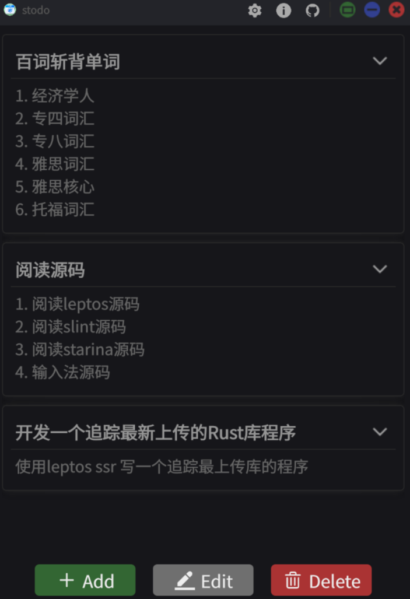

    
    

[中文文档](./README.zh-CN.md)

### Introduction
It's a dead simple **Todo** APP based on `Rust` and `Slint-UI`. This project can be compiled to `Windows`, `Linix` and `Macos`.

### How to build?
- Install `Rust`, `Cargo`
- Run `make desktop-debug` to run it on desktop platform
- Run `make desktop-build-release` to build a release version desktop application
- Refer to [Makefile](./Makefile) for more information

### TroubleShoot
`Slint` does not support setting window position on `wayland`. So you can't move the APP by dragging the title bar. Now, you should edit the configure file: `~/.config/stodo/stodo.toml`. And then changing the `no_frame = true` to `no_frame = false`. It will use the system title bar.

### Reference
- [Slint Language Documentation](https://slint-ui.com/releases/1.0.0/docs/slint/)
- [slint::android](https://snapshots.slint.dev/master/docs/rust/slint/android/#building-and-deploying)
- [Running In A Browser Using WebAssembly](https://releases.slint.dev/1.7.0/docs/slint/src/quickstart/running_in_a_browser)
- [github/slint-ui](https://github.com/slint-ui/slint)
- [Viewer for Slint](https://github.com/slint-ui/slint/tree/master/tools/viewer)
- [LSP (Language Server Protocol) Server for Slint](https://github.com/slint-ui/slint/tree/master/tools/lsp)
- [developer.android.com](https://developer.android.com/guide)
- [color4bg](https://www.color4bg.com/zh-hans/)
- [How to Deploy Rust Binaries with GitHub Actions](https://dzfrias.dev/blog/deploy-rust-cross-platform-github-actions/)
